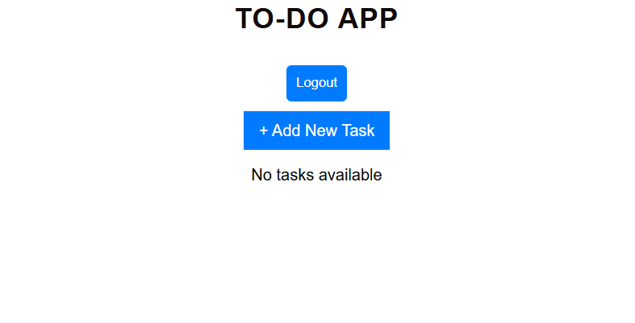
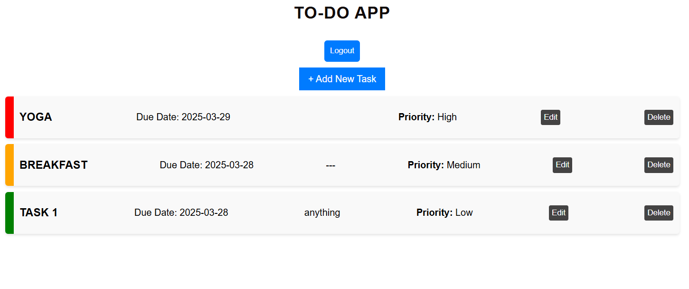

# To-Do App with React-Redux

A simple task management app built using **React.js, Redux, and Redux Thunk**.

##  Features
- Add, edit, delete, and prioritize tasks.
- Redux store for state management.
- User authentication (dummy login/logout).
- Responsive UI with **CSS styling**.

## 📸 Screenshots
*Homepage*



*TaskList*




## 🛠 Tech Stack
- **Frontend**: React.js, Redux, React-Redux
- **State Management**: Redux
- **Styling**: CSS

## 🏗️ Setup & Installation

**1. Clone the repository:**
   ```sh
   git clone https://github.com/your-repo.git
   ```

**2. Navigate into the project folder:**

```sh
cd your-project
```

**3. Install dependencies:**

```sh
npm install
```

**4.Start the development server:**

```sh
npm start
```


   
## Folder Structure
```sh


todo-app/
│── src/
│   ├── components/
│   │   ├── TaskInput.js
│   │   ├── TaskList.js
│   ├── redux/
│   │   ├── actions/
│   │   ├── reducers/
│   │   ├── store.js
│   ├── App.js
│   ├── index.js
│── public/
│── README.md
│── package.json
│── .gitignore

```